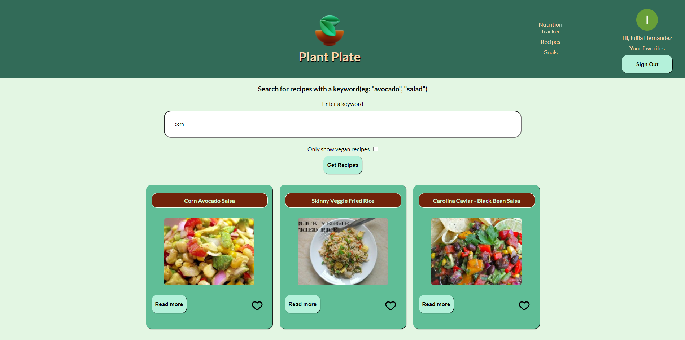
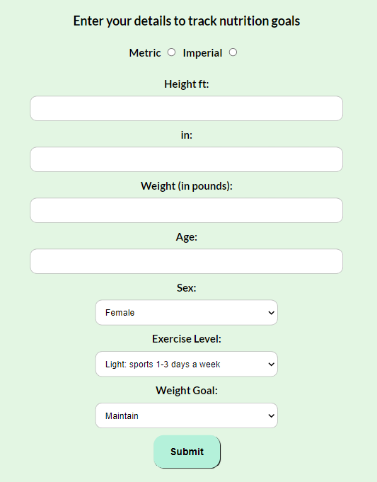
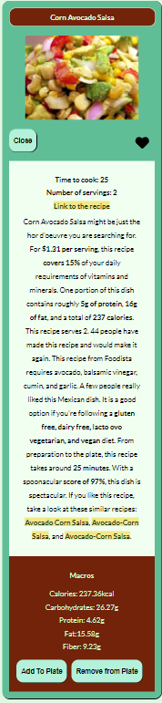
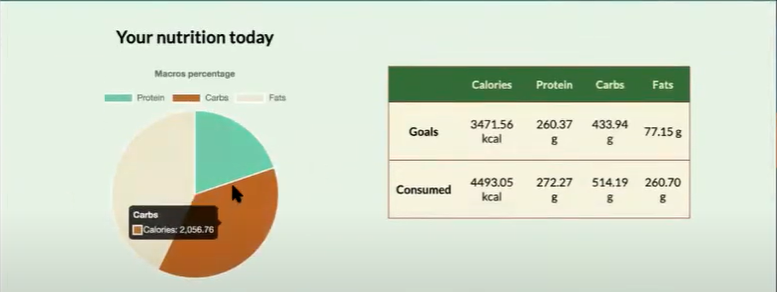

# Plant Plate

Welcome to **Plant Plate**, a web app designed for vegans and vegetarians to discover delicious recipes, keep track of their nutrition, and manage their meal plans.

## Table of Contents

- [Introduction](#introduction)
- [Features](#features)
- [Technologies Used](#technologies-used)
- [Contributing](#contributing)
- [Screenshots](#screenshots)

## Introduction

**Plant Plate** is a platform where vegans and vegetarians can explore a wide range of recipes, track their nutrition intake, and save their favorite recipes and meal plans. Our app aims to simplify the plant-based lifestyle, making it easier and more enjoyable. We decided to create this project because there are three vegans/vegetarians in our group, and we know how tricky it is to find good vegan recipes and how important it is to keep track of your macros on a plant-based diet.

## Features

- **Recipe Lookup**: Find vegan and vegetarian recipes easily.
- **Nutrition Tracking**: Keep track of your daily nutrition intake.
- **Favorites & Meal Plans**: Save your favorite recipes and organize them into meal plans.
- **User Authentication**: Secure user authentication and management with Firebase.

## Technologies Used

- **Frontend**: React, TypeScript
- **Backend**: Node.js, Express
- **Database**: MongoDB
- **API**: Spoonacular API for recipe data
- **Authentication**: Firebase

## Contributing

<a href="https://github.com/tmcarron">Tyler Carron</a>
<a href="https://github.com/Yulia182">Yulia Hernandez</a>
<a href="https://github.com/nbrendel27">Nickolas Brendel</a>
<a href="https://github.com/manojna18">Manogna Maddipatla</a>

## Screenshots

### Recipe View

_The Recipes View allows users to browse and search for a variety of vegan and vegetarian recipes. Each recipe is displayed with a preview image, title, and add-to-favorite list button._

_This Form enables users to set their personal nutrition goals._

_The Recipe Details View provides an in-depth look at each recipe. Users can view detailed nutritional information. This view also offers option to add recipe to user's meal plan._

_The Nutrition Piechart View visually represents the user's daily nutritional intake. The pie chart breaks down the proportions of calories, proteins, fats, and carbohydrates consumed, allowing users to easily see if they are meeting their nutrition goals._
